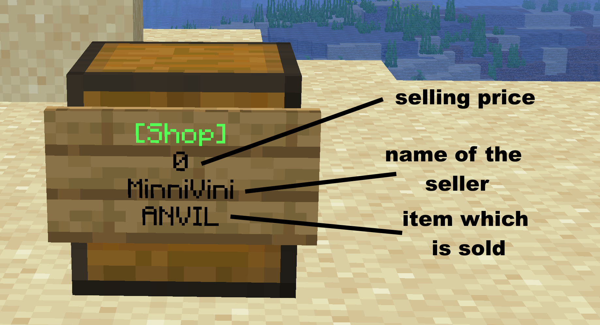

# Chestshops

Chestshops allow you to buy and sell items in Surviville.&#x20;

***

### Create Shop

-To set the sold item, you should first put your item in the first slot in the chest

-Place a sign on a chest

-Write in first Line \[Shop] to create a shop

-in the 2nd line you can set the selling price (e.g. 100 = $100). If you want your chest to buy items from other players, just write a "b" before or behind the price
\
in the fourth line, you can specify the desired quantity that you want to sell or buy at that price.

now you can click on Done, and your store sign should have been created\
 

<figure><figcaption></figcaption></figure>

***

### Commands

✅ `/chestshop info` - Get information on a chestshop that you are looking at.\
✅ `/chestshop search <item>` - Find a chestshop with a certain item. 

***

### Tips and Good to Know

⭐ You can crouch to buy stacks of an item\
⭐ Be mindful of chest limits when building a shop
